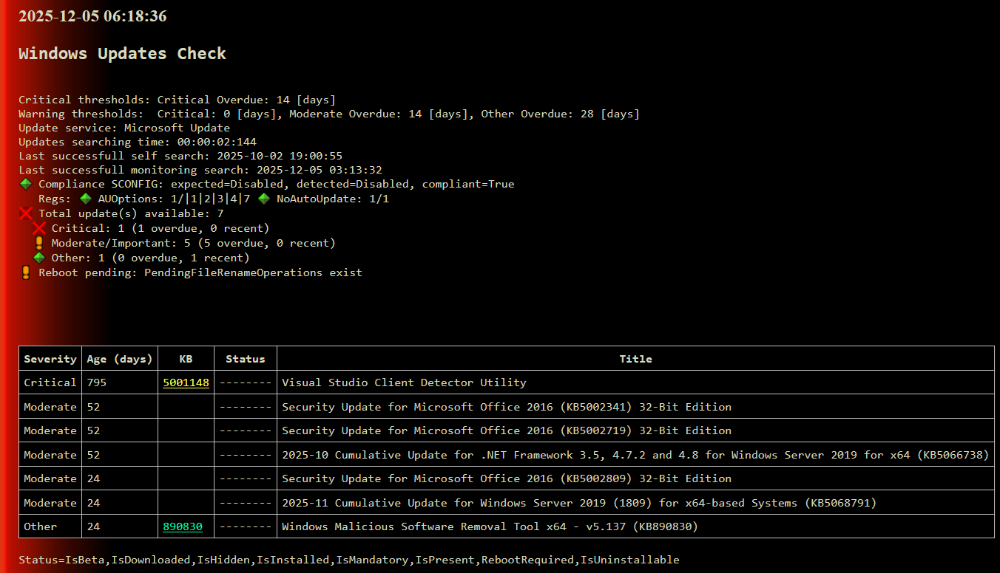

# Xymon powershell client with Windows updates centrally managed 

## Content
- A working procedure to have Xymon monitoring with the powershell client and a **Windows Updates extension script** 
- Tested so far with Windows 2016, Windows 2019, Windows 10, Windows 11

## Prerequisite 1: The powershell client (agent)
- https://sourceforge.net/p/xymon/code/HEAD/tree/sandbox/WinPSClient/ 
- Installed by following the doc: https://sourceforge.net/p/xymon/code/HEAD/tree/sandbox/WinPSClient/XymonPSClient.doc?format=raw (but you probably do not need it)
    - The powershell agent installation steps: Open cmd prompt as admin 
        ```
        mkdir "c:\Program Files\xymon"
        mkdir "c:\Program Files\xymon\ext"
        mkdir "c:\Program Files\xymon\tmp"
        ```
        
    - Review xymonclient_config.xml and at the least, set the Xymon server address.
    - Copy the following files to a directory on the target server (e.g. c:\program files\xymon) 
        - xymonclient.ps1
        - nssm.exe
        - xymonclient_config.xml
    -	Run the following command to install the service from a PowerShell prompt (may need to be an administrative prompt):
        ```
        powershell -executionpolicy unrestricted -File "c:\Program Files\xymon\xymonclient.ps1" install
        powershell -executionpolicy unrestricted -File "c:\Program Files\xymon\xymonclient.ps1" start
        ```

Remarks
- You have now a service called XymonPSClient: You can restart it to trigger the script and see the result in Xymon
- my Xymonclient_config.xml:

    ```
    <XymonSettings>
            <servers>xymon.domain.tld</servers>
            <clientlogfile>c:\program files\xymon\xymonclient.log</clientlogfile>
            <clientconfigfile>c:\program files\xymon\clientconfig.cfg</clientconfigfile>
            <clientfqdn>1</clientfqdn>
            <clientlower>0</clientlower>
            <wanteddisks>2 3 4</wanteddisks>
            <clientremotecfgexec>1</clientremotecfgexec>
            <externalscriptlocation>c:\program files\xymon\ext</externalscriptlocation>
            <externaldatalocation>c:\program files\xymon\tmp</externaldatalocation>
            <XymonAcceptUTF8>1</XymonAcceptUTF8>
            <clientbbwinmembug>0</clientbbwinmembug>
    </XymonSettings>
    ```

- Change the server's name with yours!  
- I use only fqdn: my client also! 
- If you download the files through internet, they can be blocked (right click on the files, properties, unblock and apply)
- If you need to edit them, use notepad as admin and use "save as"
- The **Xymon agent files** (`xymonclient.ps1`, `xymonclient_config.xml`) should be in ANSI (check with notepad "save as"). The `updates.ps1` script itself is UTF-8 with BOM and must stay that way - do not re-encode it.

## The Xymon config in Central Mode
This explains how to have
- A centrally managed powershell client
- A centrally managed repository for all the external scripts

The powershell client announce itself to the Xymon server by default as 
- Class : powershell
- OS    : powershell

Configuration:
- In etc/analysis.cfg, at the end, but before the DEFAULT section 
    ```
    CLASS=powershell
            LOAD 50 80
            LOG %.*  %^error.* COLOR=red #IGNORE=TermServDevices \(
            LOG %.*  %^warning.* COLOR=yellow IGNORE=%.*TermServDevices.*
            LOG %.*  %^failure.* COLOR=yellow
    ```
- In etc/xymonserver.cfg, increase the message size (not sure it is really needed but seems a good value)
    ```
    MAXMSG_CLIENT=1024              # clientdata messages (default=512k)
    ```
- In "download", put the updates.ps1 script     
    ```
    wget https://raw.githubusercontent.com/bonomani/Xymon-powershell-client-with-Windows-updates-centrally-managed/main/updates.ps1
    md5sum ./updates.ps1
    ```
- In etc/client-local.cfg: replace the hash with the md5 just done above
    ```
    [powershell]
    clientversion:2.42:https://x.x.x.x/xymon/download/ 
    external:everyscan:async:bb://updates.ps1|MD5|016e2f3725f-hash-to-be-replaced-a85ebe267b3d83|powershell.exe|-executionpolicy remotesigned -file "{script}"
    xymonlogsend
    ```
- restart xymon
- Optionally, if you dont want that this error propagate: In etc/hosts: 
    ```
    10.0.0.1              myserver.domain.tld                 # nopropyellow:updates nopropred:updates
    ```
Remarks
- In etc/analysis.cfg. I did configured the LOAD to have something better than the default values! (I do not know if the LOG entries are really useful, see above)
- In etc/client-local.cfg you need at least the [powershell] section (can be empty), otherwise the CLASS=powershell in etc/analysis.cfg seems not to work??? (The [powershell] section does not exist at all... so you will have to create it first! But it could/should exist as a default empty section in the client-local.cfg (Xymon Bug?)
- the clientversion is not tested by me so far, but should do the equivalent as using the bb protocol but secured! (so this is the best option):  We should be able to replace "bb" by "https://x.x.x.x/xymon/download/": both option should be valid (even with http!) and this for the Xymon client itself and external scripts as their process are both managed by the Xymon client. The hash seems more optional than for external scripts as a change is managed by the version number (but I think it is a good idea to have it also)
- The "external" line 
    - uses the native bb protocol, but you should also be able to use http (check that the updates.ps1 is not blocked if it is downloaded with http as this can be a problem/bug)
    - WUA `Search()` is wrapped in a 10 min timeout per attempt; with the default 1 attempt per tick and cross-run retry (max 5 consecutive failures), a stuck Update Agent costs at most ~10 min per scan and ~25 min total before the script backs off until the cache TTL or an AU trigger fires again. Use `slowscan` and `async` in the `external` line so Xymon does not time out the column.
- You can test your script with: powershell.exe -executionpolicy remotesigned -file "c:\program files\xymon\ext\updates.ps1"
- Check if your MD5 is correct: md5sum ./updates.ps1 and adjust it in your etc/client-local.cfg!
- Check the log file on your windows server "c:\program files\xymon\xymonclient.log", you should see that 
     - if the MD5 hash just changed in your etc/client-local.cfg (dont forget to restart xymon) the updates.ps1 script should be downloaded 
- Updates are in UTF-8, so you have to use \<XymonAcceptUTF8\>1\</XymonAcceptUTF8\> (or you should modify the script: end of it)
     - Check what you receive at the xymon server side in the folder that receive host's data: /var/lib/xymon/hostdata/ 
     - For Apache: Your webserver should also have UTF-8 configured, in /etc/apache2/conf-available/charset.conf uncomment:
          AddDefaultCharset UTF-8
- Check that your Xymon client-local.cfg are still in ansi(ascii) and not in UTF-8: 
    ```
    file -bi ./client-local.cfg
    ```  
- The "xymonlogsend" line allow to have a test/column named "xymonlog" for you windows machine that contains the "c:\program files\xymon\xymonclient.log" file
- To check that the "xymonlogsend" line is working, see the last line of the "c:\program files\xymon\xymonclient.log" file is: XymonLogSend - sending log 
- Severity buckets and thresholds are configurable via `-CriticalityLevel` (`Low` / `Standard` / `High`, default `Low`). In `Low`, Critical updates raise yellow immediately and red after 14 days; Important/Moderate/Other raise yellow only when overdue (21 / 28 / 56 days respectively). The threshold table is printed in every report under "Severity thresholds (days)". Override individual values with `-CriticalLimit`, `-ImportantLimit`, etc.

## Contributing

Pull requests welcome. Open a GitHub issue first if the change affects
the report's Xymon column status (colour escalation, severity buckets,
cache invalidation) so the policy intent can be discussed before the
diff. `updates.ps1` is monitoring-only - it does not write to the
registry, configure AU policy, or modify services; PRs that change
that scope are out of scope.

## Windows Update troubleshooting (generic procedure)

When the script reports `Update unreachable` or `Last probe online: n/a`,
the underlying Windows Update Agent is failing - the script itself just
relays that state. The procedure below covers the standard order to
diagnose and repair WUA without breaking it. Sources: Microsoft
KB947821 ([Fix Windows Update errors](https://learn.microsoft.com/en-us/troubleshoot/windows-server/installing-updates-features-roles/fix-windows-update-errors))
and the [WinSxS cleanup guidance](https://learn.microsoft.com/en-us/windows-hardware/manufacture/desktop/clean-up-the-winsxs-folder).

### 1. Order of operations

```text
network / proxy check
  v (ok)
DISM /restorehealth
  v (ok)
sfc /scannow
  v (still failing)
reset WU services + folders
  v (still failing)
analyse CBS.log + Setup event log
```

The order matters: SFC repairs files by pulling clean copies from the
WinSxS component store, so the store must be healthy first. That is
what DISM `/Restorehealth` does. Running SFC before DISM is a common
mistake - Microsoft KB947821 specifies DISM first, then SFC, then
restart.

### 2. Safe commands (standard use)

#### 2.1 Network / proxy check (do this first)

The most common cause of "Windows Update is unreachable" is a
misconfigured WinHTTP proxy, not corruption. WUA uses **WinHTTP**, not
WinINET / IE settings.

```cmd
netsh winhttp show proxy
```

```powershell
Test-NetConnection windowsupdate.microsoft.com -Port 443
Get-Service wuauserv,BITS,UsoSvc | Format-Table Name,Status,StartType
```

If the proxy is wrong, import the IE settings into WinHTTP:

```cmd
netsh winhttp import proxy source=ie
```

#### 2.2 Component store and system files (DISM first, then SFC)

```cmd
dism /online /cleanup-image /checkhealth
dism /online /cleanup-image /scanhealth
dism /online /cleanup-image /restorehealth
sfc /scannow
```

`/CheckHealth` and `/ScanHealth` are read-only; `/RestoreHealth` repairs
from Windows Update or a local source. SFC then re-fills the protected
files from the (now healthy) store.

#### 2.3 Reset Windows Update state

```cmd
net stop wuauserv
net stop bits
net stop cryptsvc

ren C:\Windows\SoftwareDistribution SoftwareDistribution.old
ren C:\Windows\System32\catroot2 catroot2.old

net start cryptsvc
net start bits
net start wuauserv
```

Renames the download cache and the signature catalog so AU regenerates
them on the next scan. No system state lost.

#### 2.4 Manual install / trigger scan

```cmd
wusa.exe KBxxxx.msu
dism /online /add-package /packagepath:<cab>
usoclient.exe StartScan
```

`USOClient StartScan` is the modern equivalent of the legacy
`wuauclt /detectnow`.

#### 2.5 Analyse logs

```cmd
findstr /i "error failed" C:\Windows\Logs\CBS\CBS.log
```

```powershell
Get-WinEvent -LogName Setup -MaxEvents 50
```

`CBS.log` is the source of truth for component-store events.

#### 2.6 Routine WinSxS cleanup

```cmd
dism /online /cleanup-image /startcomponentcleanup
```

Drops superseded versions only, keeps PSFX rollback compatible.

### 3. Commands to use with caution

```cmd
dism /online /disable-feature /featurename:<Feature> /remove
```

Removes a feature's payload. Re-enabling requires an external source.
Can break dependent features if used carelessly.

```cmd
dism /online /remove-package /packagename:<name>
```

Documented for advanced CBS troubleshooting (Microsoft KB947821).
Windows refuses to remove protected packages (returns `0x800f0825`),
but removing a package that has dependent packages still in use can
leave the system non-patchable. Identify dependencies first with
`dism /online /get-packages /format:table`.

### 4. Commands not to run on a production host

```cmd
dism /online /cleanup-image /startcomponentcleanup /resetbase
```

Removes every superseded WinSxS version. **Irreversible** - you lose
the ability to uninstall any update from now on, and you lose the
differential ("forward delta") payloads that future cumulative updates
rely on. Microsoft documents it for image preparation, not for live
hosts.

```text
manually deleting C:\Windows\WinSxS or C:\Windows\servicing
```

Immediate corruption. Not supported. Recovery typically requires a
repair install or reimage.

### 5. Underlying principle

Windows Update relies on a complete and self-consistent WinSxS
component store. Anything that removes versions from that store
(`/ResetBase`) or deletes its contents (manual `rm`) breaks the
contract future updates rely on. The "safe" commands in section 2
never remove a version that is still referenced - they only
reorganise or replenish.
